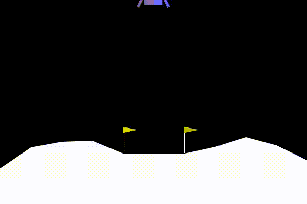

# PPO

A simple implementation of PPO using pytorch both for continuous and discrete action spaces.

 |  
:-------------------------:|
Pendulum (continuous action space), Rolling out the actor after 3,000,000 timesteps.

 |
:--:|
Lunar Lander (discrete action space), Rolling out the actor after 6,000,000 timesteps.