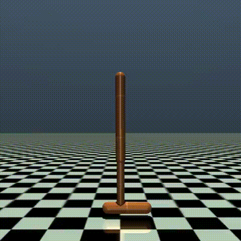
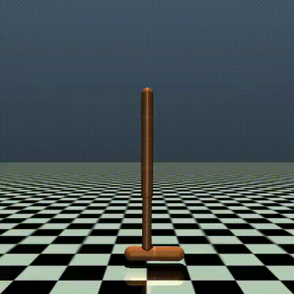
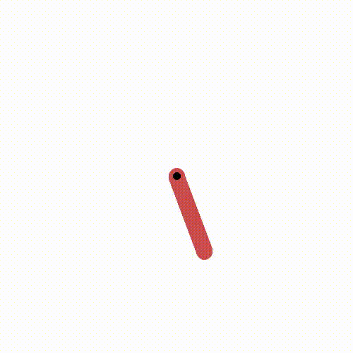

# Soft Actor-Critic

This version only supports continuous action spaces.

A brief guide about SAC is available in [spinningup](https://spinningup.openai.com/en/latest/algorithms/sac.html) documentation.

 |  
:-:|:-
Rolling out the SAC actor after 1000 episodes for Hopper-V4 | Rolling out the SAC actor after 1200 episodes for Hopper-V4
 |  
Rolling out the SAC actor after 1400 episodes for Hopper-V4 | Rolling out the SAC actor after 1500 episodes for Hopper-V4

 |  
:-------------------------:|
The result of trained SAC agent after 200 episodes for Pendulum environment.